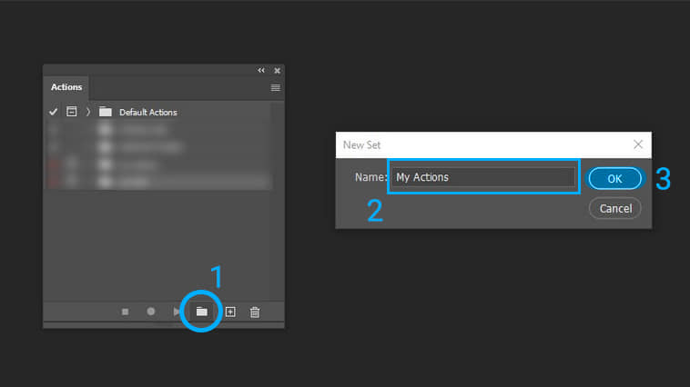
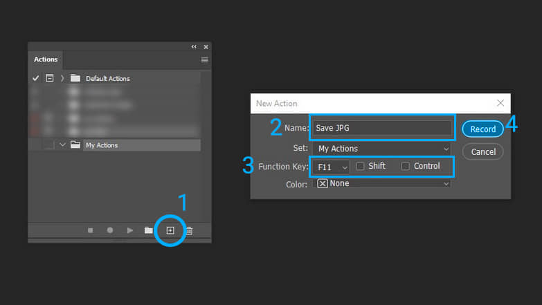
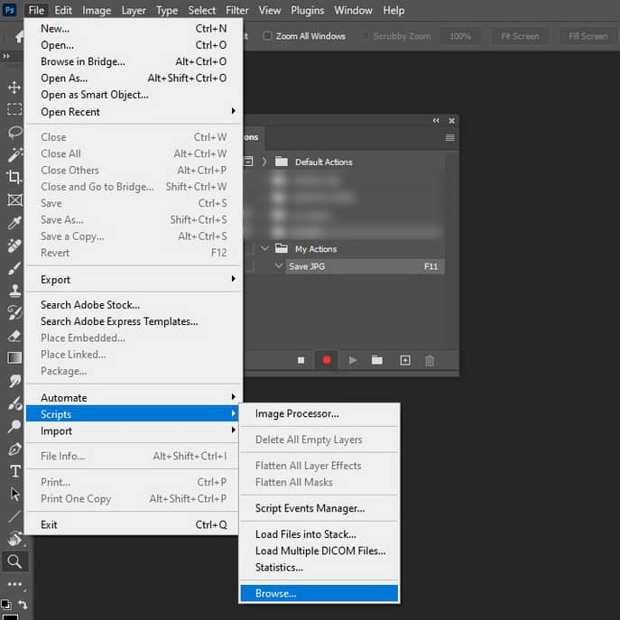
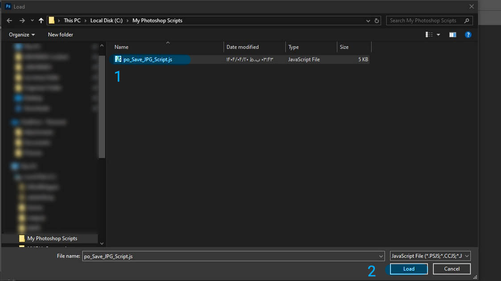
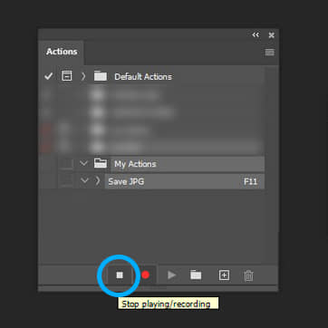
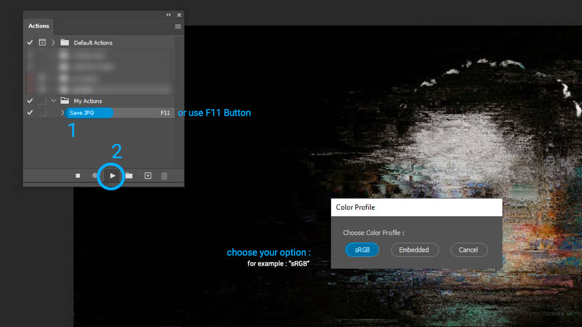
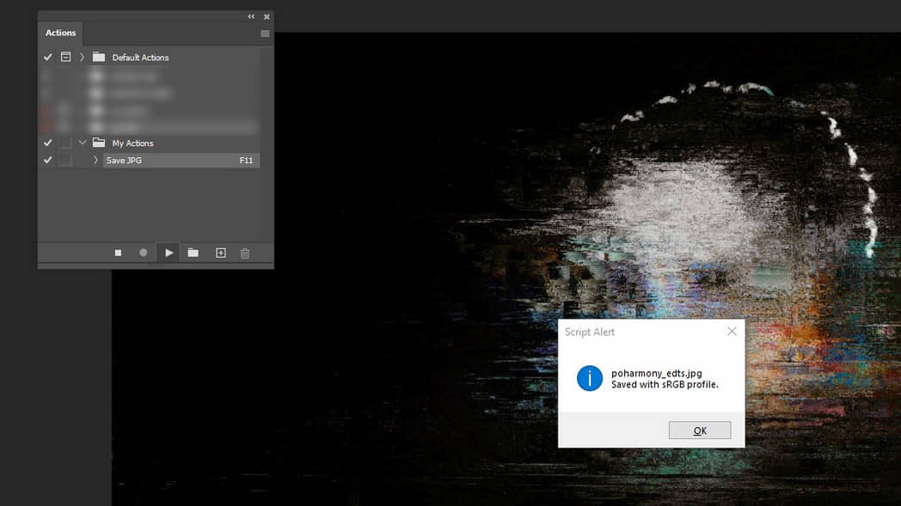

## 💡 About
This script helps you save your document with any format to "JPEG" format more easily and quickly.

## 🔩 Details and Features
* Choose Option: sRGB or Embedded Color Profile
* Choose Option: How to Deal with Repeated Filename
* Quality: Maximum (12)
* Format Option: Standard Baseline
* Save Location: Same Folder of Original Document

## ⚙️ How to use script in photoshop
1. Download 'po_Save_JPG_Script.js' script file.
2. in photoshop: **File > Scripts > Browse > choose script file > Load**

## 📌 How to made action
Place script file in a folder and then made an "action" in photoshop for running the script and give it function key (like F11) to run script quickly and automatically.

🌁 **Guide with image** :
### 1

### 2

### 3

### 4

### 5

### 6

### 7

📺 **Guide with video** :

## ⚠️ Notes
* This script written based on Adobe Photoshop "Save as" algorithm and not tested with other apps.
* If you use action, place script file in a folder that don't want move or delete it in future.

## 📜 License
This project is released under the MIT license.

## 🌐 it's po
https://poharmony.com
